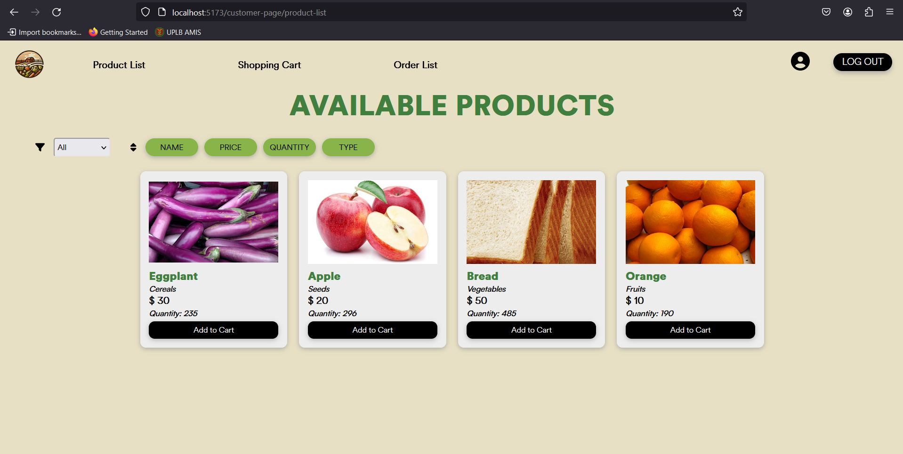

# Farm-to-table
**Group Members:**
Abelarde, Dominic  
Anareta, Nadine  
Gabriel, Lorenz  
Gonzales, Paula Victoria  

**Section:**
U-1L

## Description
"Farm-to-table" means a social movement emphasizing a direct link between consumers and farmers as the source of food. Your task involves developing an e-commerce website that will be used by the Department of Agriculture (DA) to facilitate transactions between farmers and customers directly. The DA will have the capability to compile a catalog of items for sale in the public market.

This project is a web application developed using the MERN stack (MongoDB, Express.js, React.js, Node.js). This is in partial fulfillment for CMSC 100.

## Project Features

- **User Authentication:** Users can register using their email address and login to access the system. Only registered users can access the website.
- **User Authorization** Differentiates between customer users and Department of Agriculture (DA) users. DA users have administrative privileges.
- **E-commerce Management (Administrator/Merchant):** DA users can manage user accounts, product listings, order fulfillment, and sales reports.
- **Shop (Customer Users):** Customers can view product listings, manage their shopping cart, place orders, and view their order history.
- **User Management and History of Purchases:** Customers have profiles containing their purchase history, enabling them to view past orders and update their personal information.

## Screenshots

**Home**
  - Homepage  
     
  - About  
     
  - Contact  
     

**Authentication**
  - Sign up  
      
  - Sign in  
      

**Authorization**
  - Customer View
    - Customer Page  
        
    - Product List  
        
    - Shopping Cart  
        
    - Order List  
        
    - Profile  
        

  - Admin View
    - Admin Page  
        
    - User Management  
        
    - Product Listings  
        
    - Order Fulfillment  
        
    - Sales Report  
        

## Technology Stack

- Frontend: React.js
- Backend: Node.js with Express.js
- Database: MongoDB (using MongoDB Compass (Atlas) for local development)

## Usage Guidelines
1. **Home**
   - You may explore the Homepage and learn more about the website.

2. **Authentication and Authorization**
   - For new customers, they have to sign up by inputting their details required in the screen (email, first name, last name, and password).
   - After signing up or for existing customers, the user will need to log in using the details they inputted.
   - For admin/merchant, only one account is available exclusive to them their email and password.

3. **Customer**
  - Product List
    - The customer will see here all the available products they can add to cart. The product name, product type, price, and quantity is shown.
    - They can filter the products using the filtering options - Name, Price, Quantity, Type.
    - Click the 'Add to Cart' button if you wish the product to be in your shopping cart.
  - Shopping Cart
    - The products the customer added to cart will be shown here. You will see the product name and its price.
    - The customer will also see the total price of all the products in their shopping cart.
    - If you wish to buy the product(s), click the Check Out button. The Back button will make you go back to the Product List.
    - After clicking the Check Out button, you will see the summary of your products and their prices.
    - Click the Place Order button if you wish to buy it formally. It will redirect you to the Order List.
  - Order List
    - The customers will see here their products checked out status. They may cancel their order.
  - Profile
    - The customer can edit their profile and see their history of items purchased here.

4. **Admin/Marchant**
  - User Management
    - The admin can see all of the registered users/customers here and the total.
    - They can also see each customer's transaction history.
  - Product Listings
    - The admin can sort the products by name, price, quantity, and type, and filter the products by type
    - The admin can add new products.
    - The admin can edit or delete existing products.
  - Order Fulfillment
    - The admin can view pending, completed, and canceled orders in this page. In short, they can view the status of each orders here. 
    - The admin can confirm  or reject pending orders, and once confirmed or rejected, the orders will be marked as completed or rejected on both the admin and customer side
  - Sales Report
    - The admin can view the sales report in this page.
    - The admin can filter among the three options: sales this week, sales this month, and sales this year.
    - The admin can also filter the sales by quantity or order date.
    - The admin can also see all of the profits they made.

5. **Log Out**
  - The users/admins can log out anytime and will still see their previous interactions and transactions.

## How To Run

1. Clone the https://github.com/lorenzzzeu/CMSC-100-U1L-Project repository
2. Open MongoDB Cloud Atlas and connect to the URI (Exclusive to developers. You may ask one of the developers to make you have access.)
3. In Visual Studio Code (Our default workspace), open a terminal for frontend and navigate to the .\src\main.jsx directory
4. In the terminal, type "npm install" to download and install the needed modules and dependencies
5. In the terminal, type "npm run dev" to run the frontend. Copy and open to your browser the localhost link stated in the terminal.
6. In Visual Studio Code (Our default workspace), open another terminal for backend and navigate to the .\backend\server.js directory
7. Type "npm install" in the terminal to download the needed modules
8. Type "node server.js" in the terminal to run the backend server
9. For merchant/admin, sign in using the "admin@admin.com" email to be authorized
10. For user, you may sign up using your email and sign in to be authorized as customer